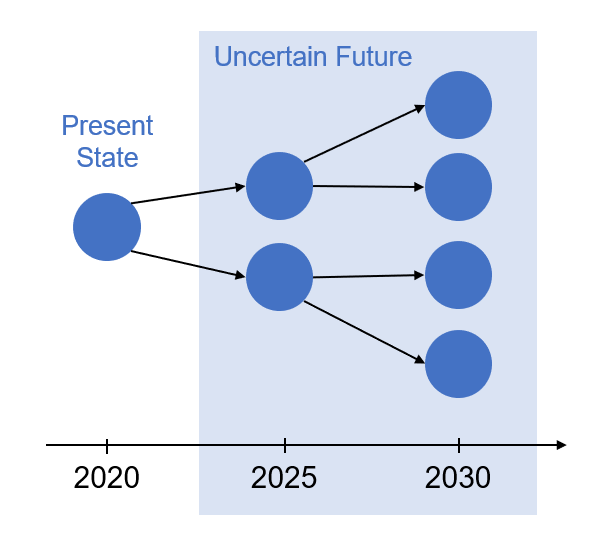
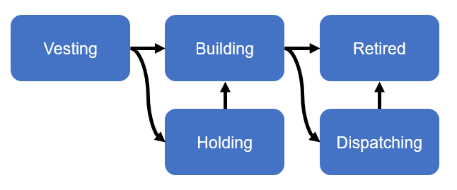
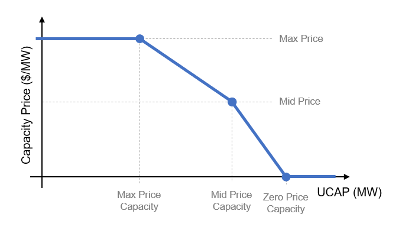

# EMIS CompetitiveEquilibrium Model

The Electricity Markets Investment Suite Competitive Equilibrium (EMIS-CE)
model is an optimization-based power system investment model developed at NREL.
It attempts to approximate a market-driven investment equilibrium outcome under
the assumption of idealized or perfect competition (e.g. no participants are
able to exert market power or leverage exclusive cost advantages) and uncertain
future conditions. The optimization problem is formulated as a stochastic
mixed-integer quadratic program (MIQP) and captures non-convexities arising
from fixed unit sizing ("lumpy investments") and clustered unit commitment
operational decisions. The associated discrete decision variables allow for
more meaningful representations of electricity market products, at the cost of
being able to provide mathematical guarantees that a reported solution is a
true equilibrium.

## Model Structure

### Scenario Tree

An EMIS-CE problem characterizes uncertain future investment and operating
conditions via a stochastic scenario tree. A solution defines actions to be
taken at each node of the tree, if that possible investment, operating, and
market context is realized, in order to maximize expected net present welfare
in the system, as seen from the tree's root scenario.

Each node of the scenario tree considers three "contexts" defining problem
parameters, decision variables, welfare contributions, and constraints.

The first context, __investment__,
is dependent on investment decisions propagated forward from the parent node's
investment context (or the overall problem's initial conditions, if the
scenario node is at the tree's root).

The second context, __operations__, is dependent on the node's investment
context.

The final context, __markets__, is dependent on the node's investment and
operations contexts.

### Investment Context

The investment context tracks the state of resource investments, their
ability to contribute to the system, and associated capital costs and
constraints across five units states: vesting, holding, building, dispatching,
and retired.

When a project is started it enters a pre-construction __vesting__ stage. Once
a project has spent a predetermined amount of time in this state, is is moved
to either a __holding__ state, where the system maintains the option to build
the project, or the __building__ state, where the option is exercised and
construction begins. Once construction is complete, the project usually enters
the __dispatching__ state, at which point it is "online" and able to contribute
to system operations and participate in markets. The project may be __retired__
at any time after construction is complete, if the fixed costs of keeping the
unit operational would exceed the expected system benefits, or a mandatory
retirement is prescribed.

Initially-available options are automatically assigned the holding state and
may be moved to the building state in the root scenario node. Intially-available built
units are assigned the dispatching state and may be moved to the retired
state in the root scenario node.

### Operations Context

The operations context handles resource-level operational decisions for each
of four categories of resources: thermal generators, variable renewable generators,
storage devices, and transmssion interfaces. Within each scenario node,
operations are simulated hourly across uniform-length, user-defined,
arbitrarily-weighted representative periods (e.g. 12 representative days,
four representative weeks, one representative year).

#### Thermal Operations
Beyond general operational constraints common to all power-injecting
resources, thermal generation units are subject to discrete unit commitment
constraints (nonzero minimum generation levels, minimum uptime, minimum
downtime), ramping limits, and startup and shutdown costs. 

#### Variable Renewables Operations
Beyond general operational constraints common to all power-injecting
resources, variable renewable units are subject to timestep-specific available
capacity constraints.

#### Storage Operations
Beyond general operational constraints common to all power-injecting
resources, storage devices must charge from the grid to be able to discharge
later, subject to a finite-size energy reservoir.

#### Transmission Operations
Pipe-and-bubble power exchanges between regions are treated as transmission
resource decisions, subject to flow limits that may vary between scenario nodes.

### Markets Context

The markets context links unit-level operations decisions with system-level
requirements (as would be communicated via product demand and price signals)
for capacity, energy, ancilliary services, and renewable energy certificates.

#### Annual Capacity Market

Each scenario node includes a capacity market clearing process that increases
system welfare based on the approximate level of unforced capacity (UCAP)
available to the system. Note that UCAP credits for each resource class are
prescribed exogenously and so are susceptible to inaccuracies in future scenario 
nodes where interactions between new resources may impact resource-level
capacity credits.

The elastic UCAP demand curve is characterized by five parameters: max price,
mid price, max price capacity, mid price capacity, and zero price capacity.

#### Hourly Energy Market

Each scenario node provides exogenously-defined, inelastic regional power
demand for each operating period. The hourly energy market contrains net power
injections within each region to match this demand level exactly, for each
period. Power that can not be provided by system resources results in unserved
energy with a procurement cost set to the regional market's price cap.

#### Hourly Raise Reserve Market

Each scenario node provides exogenously-defined, inelastic regional raise
reserve demand for each operating period. The hourly raise reserve market
attempts to provision corresponding supply from energy resources in the region.
Failure to do so results in unserved reserves with a procurement cost set to
the regional market's price cap.

#### Hourly Lower Reserve Market

Each scenario node provides exogenously-defined, inelastic regional lower
reserve demand for each operating period. The hourly lower reserve market
attempts to provision corresponding supply from energy resources in the region.
Failure to do so results in unserved reserves with a procurement cost set to
the regional market's price cap.

#### Annual REC Market

Each scenario node includes a renewable energy credit (REC) market clearing
process that attempts to provision an exogenously-defined, inelastic quantity
of energy generation from variable renewable resources. If this demand level
cannot be met, the shortfall is made up through an alternative compliance
mechanism at a scenario-specific penalty price.

## Loading Data

While the model's `Scenario` nodes and associated investment, operations, and
market context parameters can be instantiated directly as Julia
objects, the model provides a CSV-based file import functionality that may be more
convenient. Data organized according to the file structure
[described here](inputdata.html)
will be automatically populated into a corresponding `InvestmentProblem`.
